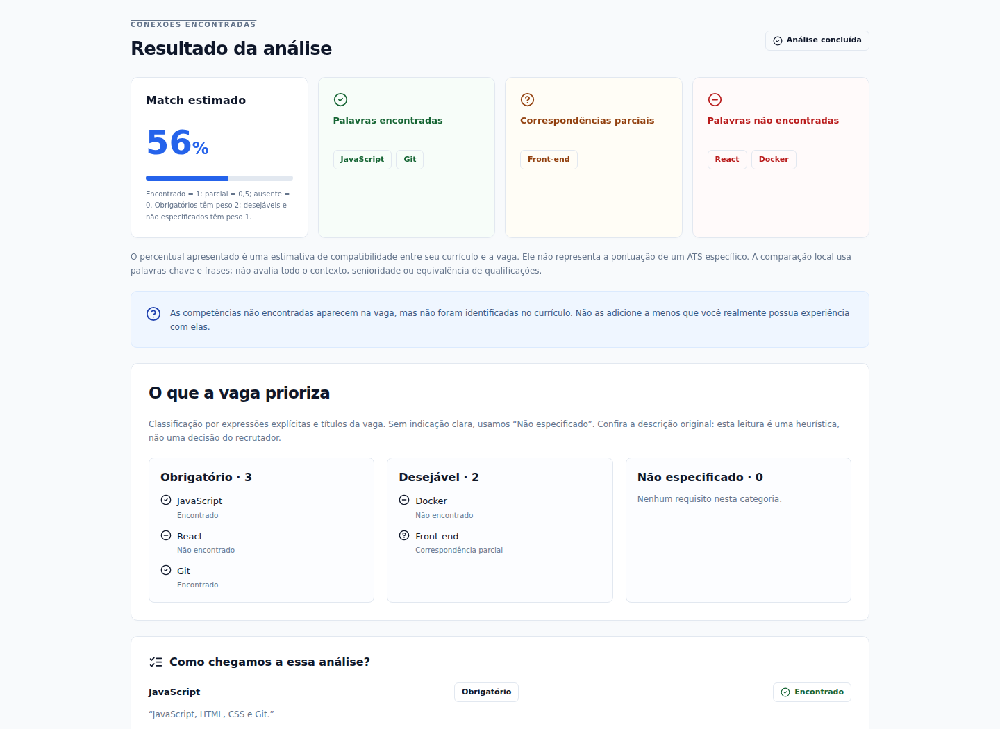
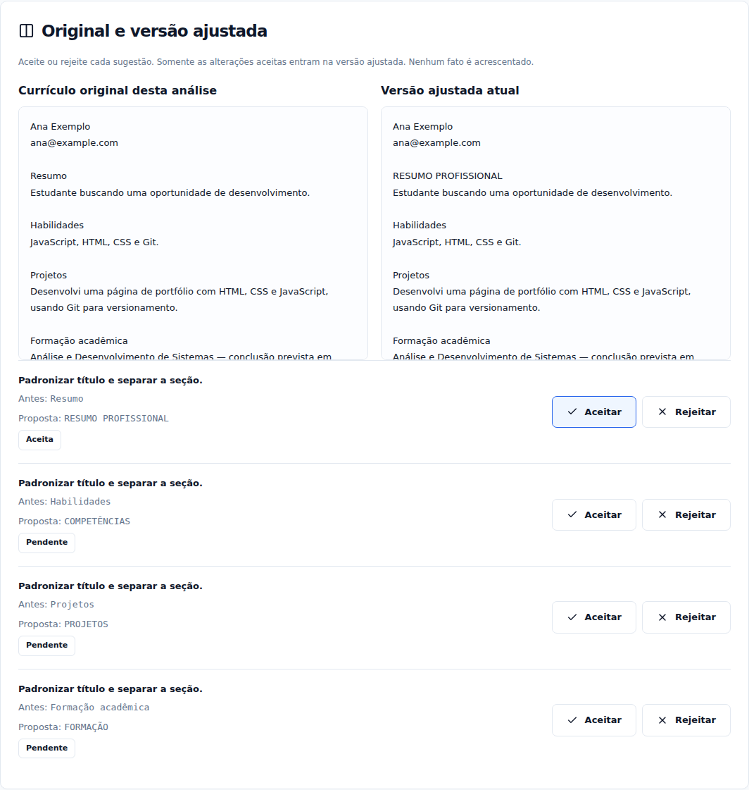
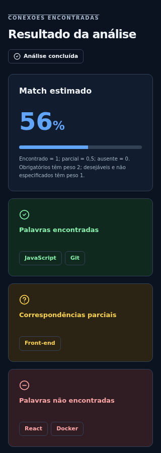

# MatchCV

**Um currículo mais claro, sem inventar uma carreira.** Compare seu currículo com uma vaga, entenda as evidências e prepare uma versão de texto simples para sistemas ATS.

- **Repositório para entrega:** [github.com/mariomoutinho/matchcv](https://github.com/mariomoutinho/matchcv)
- **Aplicação pública:** [mariomoutinho.github.io/matchcv](https://mariomoutinho.github.io/matchcv/)
- **Validação e publicação:** [GitHub Actions](https://github.com/mariomoutinho/matchcv/actions/workflows/deploy.yml)



## Qual problema resolve

Adaptar um currículo a cada oportunidade exige identificar quais experiências respondem aos requisitos da vaga. Copiar palavras-chave indiscriminadamente pode criar informações falsas, e percentuais sem explicação podem gerar expectativas incorretas.

O MatchCV mostra correspondências e ausências com evidências do próprio texto, ajuda a organizar a apresentação e mantém o usuário no controle das alterações. O público inclui estudantes, pessoas em busca do primeiro emprego, profissionais em transição e candidatos adaptando um currículo.

**Reescrever é permitido. Inventar não.** O percentual é uma estimativa de compatibilidade textual; não é uma pontuação de um ATS específico nem uma probabilidade de contratação.

## Experimente em dois minutos

1. Abra a [aplicação pública](https://mariomoutinho.github.io/matchcv/).
2. Clique em **Usar exemplo fictício** e em **Analisar currículo**.
3. Observe o match de **56%**: JavaScript e Git encontrados, Front-end parcial, React e Docker sem evidência. JavaScript, Git e React têm peso obrigatório; Docker e Front-end são desejáveis.
4. Na comparação, aceite a alteração de `Resumo` para `RESUMO PROFISSIONAL`. Rejeite-a para conferir que o original é restaurado. Decisões são individuais.
5. Confira o checklist e, se quiser explorar as perguntas, selecione React. “Não possuo” não acrescenta nada. Para demonstrar a confirmação com dados fictícios, marque “Sim”, escreva `Desenvolvi interfaces com React em um projeto acadêmico.` e confirme a veracidade **apenas no contexto deste exemplo fictício**. Reanalisar passa o exemplo a 81%, sem acrescentar Docker.
6. Edite, copie ou exporte o currículo. O PDF inclui somente o texto do currículo.

Os textos do exemplo estão em [vaga.txt](docs/examples/vaga.txt) e [curriculo.txt](docs/examples/curriculo.txt). Veja também o [PDF realmente exportado pela aplicação](docs/examples/curriculo-ats.pdf). Os dados e o e-mail de demonstração são fictícios. Em um currículo real, confirme apenas experiências que de fato possui.

## Funcionalidades entregues

| Funcionalidade          | Comportamento                                                                                                             |
| ----------------------- | ------------------------------------------------------------------------------------------------------------------------- |
| Análise explicável      | Palavras encontradas, parciais e ausentes; evidências literais; sugestões condicionadas aos fatos.                        |
| Prioridades da vaga     | Obrigatório, desejável ou não especificado, com fórmula ponderada visível.                                                |
| Importação PDF/DOCX     | Leitura local e prévia editável; só substitui o currículo após confirmação. Cancelamento/erro preservam o texto anterior. |
| Comparação de versões   | Original e versão ajustada lado a lado; aceitar/rejeitar cada mudança de título ou espaço.                                |
| Checklist ATS           | Contato, títulos, seções vazias, duplicação e sinais de tabelas; atualização durante a edição.                            |
| Perguntas sobre lacunas | Relato literal e confirmação explícita antes de acrescentar informação e reanalisar.                                      |
| Editor, copiar e PDF    | Edição livre; notificações; exportação A4, uma coluna e texto selecionável.                                               |
| Acessibilidade e tema   | Modo claro/escuro, teclado, foco visível, labels, estados com texto/ícone e responsividade a partir de 320 px.            |
| Privacidade             | Sem login, banco de currículos, histórico ou API externa de análise. Documentos ficam na memória da página.               |

## Mega prompt e iterações

O [mega prompt original](docs/mega-prompt-original.md) preserva o briefing fornecido: objetivo, regra de integridade, interface, paleta, fallback local, exportação, testes e critérios de aceitação. O anexo recebido termina truncado no item 51; essa condição está registrada no arquivo.

O [mega prompt final consolidado](docs/mega-prompt-final.md) incorpora modo escuro, importação, comparação com decisões, checklist, prioridades e confirmação de experiências. A [evolução detalhada](docs/evolucao.md) relaciona cada pedido ao motivo e à mudança entregue.

Depois da primeira geração, os pedidos de evolução foram organizados individualmente por funcionalidade:

1. **Modo escuro**, para conforto de leitura, com persistência apenas da preferência.
2. **Importação de PDF/DOCX**, para reduzir o esforço de entrada, preservando a revisão antes de substituir o texto.
3. **Comparação entre currículo original e ajustado.** Pedido: mostrar as versões lado a lado e permitir aceitar ou rejeitar cada alteração. Motivo: tornar as mudanças transparentes e manter o controle sobre o texto final.
4. **Checklist de formatação para ATS.** Pedido: identificar contato ausente, títulos pouco claros, seções vazias, duplicações e sinais de tabelas. Motivo: facilitar a revisão da estrutura, com atualização durante a edição e indicação dos limites da análise textual.
5. **Separação de requisitos obrigatórios e desejáveis.** Pedido: distinguir as prioridades da vaga e explicar sua influência no match estimado. Motivo: diferenciar exigências essenciais de diferenciais, com pesos explícitos e categoria para requisitos sem prioridade informada.
6. **Perguntas para completar experiências reais.** Pedido: perguntar sobre competências sem evidência e exigir relato e confirmação antes de incluir informações. Motivo: recuperar experiências verdadeiras omitidas sem inventar qualificações.
7. **Publicação e repositório público**, com documentação e evidências para portfólio.

**Proveniência:** esta implementação foi produzida com assistência de código no workspace e publicada via GitHub Actions. Não houve exportação do Lovable nesta sessão. O README documenta o processo efetivamente realizado, sem atribuir ao Lovable uma geração que não ocorreu.

## Como a análise funciona

1. **Entrada:** a pessoa cola a vaga e o currículo, ou importa e revisa o texto extraído de PDF/DOCX. Campos aceitam 30 a 30.000 caracteres.
2. **Extração:** o motor local normaliza caixa/acentos, procura termos e aliases de um catálogo e mantém frases explícitas de requisitos fora do catálogo. Não há chamada de IA.
3. **Prioridade:** títulos e expressões como “obrigatório” e “desejável” orientam a classificação. Sem indicação explícita, o requisito fica como não especificado. A interface pede conferência da descrição original.
4. **Evidências:** correspondência exata requer um trecho literal. Há tratamento conservador de negações e relações limitadas de front-end/back-end para parciais. JavaScript não comprova React.
5. **Match:** `100 × soma(peso × correspondência) / soma(pesos)`, arredondado. Obrigatório pesa 2; desejável/não especificado pesam 1. Encontrado vale 1; parcial 0,5; ausente 0.
6. **Ajustes:** o gerador propõe apenas padronização de títulos e espaços. O validador compara as linhas factuais. A interface aplica somente mudanças aceitas; rejeitar mantém o trecho original.
7. **Complemento opcional:** a pessoa pode fornecer uma experiência não mencionada. “Sim” sozinho não basta: é preciso relato e confirmação. O texto é anexado literalmente e vira uma nova entrada para a análise.
8. **Revisão e saída:** o checklist acompanha a versão ajustada. Edições manuais bloqueiam sugestões antigas para não sobrescrevê-las. Copiar e PDF usam o texto final do editor.

## Limites e integridade

- O motor é heurístico. Pode não reconhecer sinônimos, requisitos implícitos, contexto de negação ou relações complexas. Não comprova senioridade, fluência nem a verdade de uma experiência. A fonte de evidência é o texto fornecido pelo usuário.
- A versão local não faz reescrita semântica livre. Ela organiza títulos e espaços, preservando os fatos. Relatos e edições manuais são responsabilidade de quem os informa.
- A pontuação não garante aprovação e não representa um sistema ATS comercial. Pesos são uma regra transparente do MVP, não uma fórmula de recrutador.
- Importação: até 5 MB, PDF até 30 páginas e texto até 30.000 caracteres; sem truncamento silencioso. DOC antigo, PDFs protegidos e documentos corrompidos são recusados. PDFs digitalizados/imagens exigem OCR externo. Documentos de várias colunas precisam de revisão da ordem do texto.
- O checklist analisa o texto; não assegura que o arquivo original não tinha fotos, tabelas ou colunas. Há uma etapa explícita de conferência visual.
- O PDF usa a fonte padrão Helvetica, adequada ao português/alfabeto latino. Outros sistemas de escrita exigem uma fonte incorporada apropriada.
- Recarregar a página remove vaga, currículo e análise. Somente `matchcv-theme` é salvo no armazenamento local. Bibliotecas e workers são servidos pela própria aplicação. A hospedagem recebe as requisições normais dos arquivos estáticos, mas a aplicação não envia o currículo.

## Executar e validar

Requisito: Node.js 24, conforme [.nvmrc](.nvmrc). Não são necessárias chaves ou variáveis secretas.

```sh
npm ci
npm run dev
```

```sh
npm run format:check
npm test
npm run build
npx playwright install --with-deps chromium
npm run test:e2e
```

Os testes de navegador usam o build de produção em uma prévia local na porta 4173. O build gera uma pasta de distribuição que não é versionada. `npm run preview` serve essa distribuição apenas para conferência local.

- **20 testes unitários:** integridade, evidências, tecnologias ausentes, números, pesos, decisões individuais, checklist, relatos e limites de importação.
- **8 testes de navegador:** fluxo completo, PDF/DOCX reais, erros sem perda de texto, prioridades, revisão e relatos em desktop e 320 px; verificações axe nos estados exercitados.
- O resultado auditável da entrega, com links públicos, fica em [docs/validacao.md](docs/validacao.md). Testes automatizados de acessibilidade não substituem uma avaliação humana completa.

## Evidências da aplicação

Capturas reais do navegador com dados fictícios, produzidas pelo script [scripts/capture-evidence.mjs](scripts/capture-evidence.mjs):





As capturas foram refeitas no endereço público, sem login. O [registro da verificação pública](docs/public-verification.json) confirma HTTP 200, execução da análise, exportação/reimportação de PDF e leitura de DOCX.

A captura principal no início deste README mostra a análise. O [exemplo passo a passo](docs/exemplo-de-uso.md) descreve as entradas e resultados esperados.

## Estrutura

| Arquivo/pasta                                                | Responsabilidade                                               |
| ------------------------------------------------------------ | -------------------------------------------------------------- |
| [src/App.tsx](src/App.tsx)                                   | Estados, entrada, resultados e coordenação da análise.         |
| [src/lib/analysis.ts](src/lib/analysis.ts)                   | Requisitos, evidências, prioridades e match ponderado.         |
| [src/lib/resume.ts](src/lib/resume.ts)                       | Propostas de formatação, decisões e integridade.               |
| [src/lib/checklist.ts](src/lib/checklist.ts)                 | Verificações textuais de formatação.                           |
| [src/lib/supplement.ts](src/lib/supplement.ts)               | Validação e inclusão literal de relato confirmado.             |
| [src/lib/resume-import.ts](src/lib/resume-import.ts)         | Extração de PDF/DOCX e limites.                                |
| [src/lib/docx.worker.ts](src/lib/docx.worker.ts)             | Extração de texto DOCX fora da interface principal.            |
| [src/lib/pdf.ts](src/lib/pdf.ts)                             | Exportação do texto do currículo.                              |
| [src/components](src/components)                             | Importação, comparação, checklist, perguntas e componentes UI. |
| [tests](tests) e [e2e](e2e)                                  | Testes unitários, testes de navegador e fixture fictícia.      |
| [docs](docs)                                                 | Prompts, evolução, exemplo, capturas e evidências.             |
| [.github/workflows/deploy.yml](.github/workflows/deploy.yml) | Validação e publicação automática.                             |

## Publicação

O repositório público pertence à conta `mariomoutinho`. Pushes na branch `main` executam formatação, testes, build e testes de navegador antes da publicação no GitHub Pages. As Actions estão fixadas por hash e usam o token temporário do próprio GitHub, sem chave pessoal no código. Assets usam caminhos relativos para funcionar no subdiretório do projeto.

Referências: [workflows do GitHub Pages](https://docs.github.com/en/pages/getting-started-with-github-pages/using-custom-workflows-with-github-pages) e [deploy de Vite](https://vite.dev/guide/static-deploy.html#github-pages).

Licença: [MIT](LICENSE).
