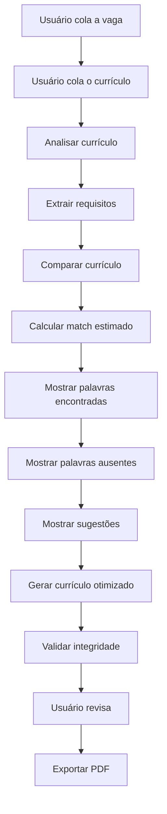

# MatchCV — Comparador de Currículo com Vaga para ATS

## Visão Geral

Crie uma aplicação web chamada **MatchCV**.

O objetivo da aplicação é comparar o currículo de uma pessoa com a descrição de uma vaga, identificar o nível de compatibilidade entre os dois conteúdos e gerar uma nova versão do currículo mais adequada para sistemas **ATS — Applicant Tracking Systems**.

> **Regra principal:** a aplicação melhora como a pessoa apresenta suas experiências, mas nunca inventa experiências, habilidades ou qualificações que ela não possui.

---

# 1. Objetivo do Produto

O usuário deve conseguir:

1. Colar a descrição completa de uma vaga.
2. Colar o próprio currículo.
3. Clicar em **Analisar currículo**.
4. Visualizar um **match estimado** entre currículo e vaga.
5. Visualizar palavras-chave encontradas.
6. Visualizar palavras-chave parcialmente relacionadas.
7. Visualizar palavras-chave importantes que não foram encontradas.
8. Visualizar os requisitos da vaga e as evidências encontradas no currículo.
9. Receber sugestões de melhoria.
10. Gerar uma versão **ATS-friendly** do currículo.
11. Editar o currículo otimizado.
12. Copiar o currículo.
13. Exportar o currículo em PDF.

O MVP deve funcionar **sem login**.

---

# 2. Princípio Fundamental

A regra central do sistema é:

> **Reescrever é permitido. Inventar não.**

A aplicação pode:

- reorganizar informações;
- melhorar a clareza;
- melhorar a escrita;
- reorganizar experiências profissionais;
- destacar competências relevantes;
- aproximar a linguagem do currículo da linguagem da vaga;
- remover redundâncias;
- reorganizar competências;
- melhorar descrições profissionais;
- destacar palavras-chave existentes.

A aplicação nunca pode inventar:

- experiências profissionais;
- empresas;
- cargos;
- tecnologias;
- habilidades;
- certificações;
- formação acadêmica;
- projetos;
- idiomas;
- resultados;
- métricas;
- números;
- porcentagens;
- tempo de experiência;
- responsabilidades não informadas.

---

# 3. Regra de Integridade

Considere a seguinte vaga:

```text
Buscamos profissional com conhecimentos em:

- JavaScript
- React
- Git
- Docker
```

E o seguinte currículo:

```text
Desenvolvimento de aplicações utilizando JavaScript e Git.
```

O resultado correto deve ser:

```text
JavaScript → Encontrado
Git → Encontrado
React → Não encontrado
Docker → Não encontrado
```

A aplicação **não pode adicionar React ou Docker ao currículo otimizado**.

Em vez disso, deve apresentar:

> A vaga menciona React, mas não encontramos essa competência no currículo informado. Inclua essa habilidade somente se você realmente possuir experiência com ela.

---

# 4. Transparência

Mostrar claramente na interface:

> **O MatchCV melhora como você apresenta suas experiências, mas nunca inventa experiências, habilidades ou qualificações que você não informou.**

Mostrar também:

> O percentual apresentado é uma estimativa de compatibilidade entre seu currículo e a vaga. Ele não representa a pontuação de um ATS específico.

Nunca utilizar expressões como:

- Nota do ATS;
- Pontuação real do ATS;
- Chance de contratação;
- Chance de aprovação;
- Probabilidade de conseguir a vaga.

Utilizar:

**Match estimado**

---

# 5. Público-Alvo

A aplicação deve atender principalmente:

- pessoas procurando emprego;
- pessoas procurando estágio;
- pessoas buscando primeiro emprego;
- profissionais em transição de carreira;
- estudantes;
- profissionais adaptando o currículo para uma vaga específica.

A experiência deve ser simples mesmo para pessoas com pouca familiaridade com tecnologia.

---

# 6. Design System

Utilizar **shadcn/ui**.

Utilizar componentes como:

```text
Button
Card
Textarea
Badge
Progress
Tabs
Tooltip
Alert
Separator
Dialog
Toast
Skeleton
```

Utilizar **Lucide Icons** quando necessário.

O visual deve transmitir:

- profissionalismo;
- clareza;
- simplicidade;
- tecnologia;
- confiança.

Evitar excesso de elementos decorativos.

---

# 7. Paleta de Cores

Criar tokens de design para a seguinte paleta:

```css
:root {
  --primary: #2563EB;
  --primary-dark: #1D4ED8;

  --background: #F8FAFC;
  --surface: #FFFFFF;

  --text-primary: #0F172A;
  --text-secondary: #64748B;

  --success: #16A34A;
  --warning: #D97706;
  --error: #DC2626;

  --border: #E2E8F0;
}
```

Não utilizar cor como única forma de comunicar estados.

Sempre combinar:

```text
cor + texto + ícone
```

quando necessário.

---

# 8. Design Universal e Acessibilidade

O projeto deve utilizar princípios de **Design Universal**.

O objetivo é permitir que o maior número possível de pessoas consiga utilizar a aplicação com boa experiência.

Implementar:

- contraste adequado;
- navegação por teclado;
- foco visível;
- labels associados aos campos;
- textos de ajuda;
- mensagens de erro claras;
- fontes legíveis;
- botões com áreas clicáveis confortáveis;
- layout responsivo;
- suporte para dispositivos móveis;
- compatibilidade com leitores de tela;
- atributos ARIA quando necessários;
- linguagem simples e objetiva.

Exemplo:

```html
<textarea
  aria-label="Descrição da vaga"
  placeholder="Cole aqui a descrição completa da vaga..."
></textarea>
```

Não depender somente de:

```text
verde = correto
vermelho = errado
```

Sempre adicionar textos explicativos.

---

# 9. Estrutura da Aplicação

Criar inicialmente uma aplicação **Single Page Application**.

Fluxo principal:

```text
HEADER
   ↓
HERO
   ↓
AVISO DE TRANSPARÊNCIA
   ↓
DESCRIÇÃO DA VAGA + CURRÍCULO
   ↓
ANALISAR
   ↓
RESULTADOS
   ↓
CURRÍCULO OTIMIZADO
   ↓
EXPORTAR PDF
```

Não criar dashboard neste momento.

---

# 10. Header

Criar um header simples.

## Logo

**MatchCV**

## Navegação

Adicionar somente:

```text
Como funciona?
```

Não adicionar nesta versão:

```text
Login
Cadastro
Dashboard
Planos
```

---

# 11. Hero Section

## Título

**Seu currículo fala a mesma língua da vaga?**

## Descrição

> Compare seu currículo com a descrição da oportunidade, descubra quais competências estão alinhadas e gere uma versão mais amigável para sistemas ATS.

## CTA

```text
Começar análise
```

Ao clicar, realizar scroll até a área principal.

---

# 12. Aviso Ético

Utilizar um componente `Alert`.

```tsx
<Alert>
  O MatchCV reorganiza e melhora informações já presentes no seu currículo.
  Nenhuma experiência ou competência que você não informou será criada.
</Alert>
```

Este aviso deve ficar visível antes da análise.

---

# 13. Área Principal

Criar dois cards.

## Desktop

```text
┌──────────────────────────┐  ┌──────────────────────────┐
│ Descrição da vaga        │  │ Seu currículo            │
│                          │  │                          │
│ Textarea                 │  │ Textarea                 │
│                          │  │                          │
└──────────────────────────┘  └──────────────────────────┘
```

## Mobile

```text
┌──────────────────────────┐
│ Descrição da vaga        │
└──────────────────────────┘

┌──────────────────────────┐
│ Seu currículo            │
└──────────────────────────┘
```

---

# 14. Campo — Descrição da Vaga

Título:

**Descrição da vaga**

Placeholder:

```text
Cole aqui a descrição completa da vaga...
```

Criar um `Textarea` grande.

Mostrar contador:

```text
1.842 caracteres
```

---

# 15. Campo — Currículo

Título:

**Seu currículo**

Placeholder:

```text
Cole aqui o conteúdo do seu currículo...
```

Mostrar contador de caracteres.

Adicionar texto auxiliar:

> Evite inserir informações pessoais desnecessárias, como CPF, RG ou endereço residencial completo.

---

# 16. Botão Analisar

Criar:

```text
Analisar currículo
```

O botão deve permanecer desabilitado caso os campos estejam vazios.

Exemplo:

```typescript
const canAnalyze =
  jobDescription.trim().length >= 100 &&
  resume.trim().length >= 100;
```

Exemplo de botão:

```tsx
<Button
  disabled={!canAnalyze || status === "ANALYZING"}
  onClick={handleAnalyze}
>
  Analisar currículo
</Button>
```

---

# 17. Estado de Loading

Após clicar em analisar, mostrar:

```text
Analisando compatibilidade...
```

Utilizar:

- spinner;
- `Skeleton`;
- botão temporariamente desabilitado;
- feedback visual.

Evitar múltiplos envios simultâneos.

---

# 18. Estados da Aplicação

Utilizar:

```typescript
type AppState =
  | "EMPTY"
  | "READY"
  | "ANALYZING"
  | "SUCCESS"
  | "ERROR";
```

## EMPTY

Campos vazios.

## READY

Campos preenchidos.

## ANALYZING

Análise em andamento.

## SUCCESS

Análise concluída.

## ERROR

Erro durante o processamento.

---

# 19. Extração dos Requisitos da Vaga

Analisar a descrição da vaga procurando:

- tecnologias;
- ferramentas;
- linguagens;
- frameworks;
- metodologias;
- competências técnicas;
- soft skills;
- formação;
- certificações;
- idiomas;
- experiência;
- responsabilidades;
- requisitos obrigatórios;
- requisitos desejáveis.

---

# 20. Classificação dos Requisitos

Cada requisito deve receber um dos seguintes estados:

```typescript
type RequirementStatus =
  | "FOUND"
  | "PARTIAL"
  | "NOT_FOUND";
```

## FOUND

Existe evidência clara no currículo.

## PARTIAL

Existe uma experiência relacionada, mas não correspondência exata.

## NOT_FOUND

Não existe evidência no currículo.

---

# 21. Estrutura dos Dados

Utilizar uma estrutura semelhante:

```typescript
interface RequirementAnalysis {
  requirement: string;
  status: "FOUND" | "PARTIAL" | "NOT_FOUND";
  evidence?: string;
}

interface AnalysisResult {
  matchScore: number;

  keywordsFound: string[];

  keywordsPartial: string[];

  keywordsMissing: string[];

  requirements: RequirementAnalysis[];

  suggestions: string[];

  optimizedResume: string;
}
```

Separar claramente:

```text
UI
↓
Analysis Engine
↓
Resume Generator
↓
Integrity Validator
↓
PDF Export
```

---

# 22. Match Estimado

Calcular um percentual entre:

```text
0 e 100
```

Nome do indicador:

**Match estimado**

Exemplo:

```text
78%
```

Exemplo de componente:

```tsx
<Card>
  <CardHeader>
    <CardTitle>Match estimado</CardTitle>
  </CardHeader>

  <CardContent>
    <div className="text-4xl font-bold">
      {matchScore}%
    </div>

    <Progress value={matchScore} />
  </CardContent>
</Card>
```

Adicionar abaixo:

> Esta pontuação representa uma estimativa de compatibilidade entre os conteúdos e pode variar entre processos seletivos e sistemas ATS.

---

# 23. Resultado da Análise

Criar uma seção:

## Resultado da análise

Apresentar inicialmente quatro cards:

```text
Match estimado

Palavras encontradas

Correspondências parciais

Palavras não encontradas
```

---

# 24. Palavras Encontradas

Exemplo:

```text
JavaScript
Git
REST API
Automação
n8n
```

Utilizar `Badge`.

Exemplo:

```tsx
<Badge variant="default">
  JavaScript
</Badge>
```

---

# 25. Correspondências Parciais

Exemplo:

```text
Requisito da vaga:
Desenvolvimento Front-end

Currículo:
Experiência com HTML, CSS e JavaScript

Status:
Correspondência parcial
```

Não assumir conhecimento em tecnologias específicas sem evidência.

Por exemplo:

> Saber JavaScript não significa automaticamente saber React.

---

# 26. Palavras Não Encontradas

Exemplo:

```text
React
Docker
AWS
```

Mostrar aviso:

> Essas competências aparecem na vaga, mas não foram identificadas no currículo. Não as adicione ao currículo a menos que você realmente possua experiência com elas.

---

# 27. Evidências

Criar seção:

## Como chegamos a essa análise?

Exemplo:

```text
Requisito:
JavaScript

Status:
Encontrado

Evidência:
"Desenvolvimento de aplicações utilizando JavaScript."
```

Outro exemplo:

```text
Requisito:
Docker

Status:
Não encontrado

Evidência:
Nenhuma evidência encontrada no currículo.
```

Nunca gerar evidências inexistentes.

---

# 28. Sugestões de Melhoria

Criar card:

## Como melhorar seu currículo para esta vaga

Exemplos válidos:

> JavaScript aparece no seu currículo e também possui relevância para a vaga. Considere dar maior destaque a essa competência.

> Sua experiência com automação está presente no currículo, mas pode aparecer de forma mais clara na seção de competências.

Quando uma habilidade estiver ausente:

> A vaga menciona Docker, mas não encontramos essa experiência no currículo. Inclua essa competência apenas caso realmente possua conhecimento ou experiência com ela.

Nunca instruir o usuário a adicionar uma habilidade que não possui.

---

# 29. Currículo ATS-Friendly

Criar uma seção:

## Currículo otimizado

Utilizar somente informações existentes no currículo original.

Estrutura preferencial:

```text
NOME

CONTATO

RESUMO PROFISSIONAL

COMPETÊNCIAS

EXPERIÊNCIA PROFISSIONAL

PROJETOS

FORMAÇÃO

CERTIFICAÇÕES

IDIOMAS
```

Criar somente seções com conteúdo.

Não criar seções vazias.

---

# 30. Formatação ATS-Friendly

Utilizar:

- uma coluna;
- fonte legível;
- hierarquia simples;
- títulos tradicionais;
- texto selecionável;
- estrutura linear;
- espaçamento consistente.

Evitar:

- tabelas;
- gráficos;
- barras de habilidade;
- fotografias;
- múltiplas colunas;
- elementos decorativos excessivos;
- ícones substituindo palavras;
- caixas de texto complexas.

---

# 31. Reescrita Permitida

Texto original:

```text
Fiz automações usando n8n.
```

Versão permitida:

```text
Desenvolvimento de automações de processos utilizando n8n.
```

A informação original continua verdadeira.

---

# 32. Reescrita Proibida

Texto original:

```text
Fiz automações usando n8n.
```

Versão proibida:

```text
Especialista em automação empresarial com cinco anos de experiência
utilizando n8n em projetos corporativos.
```

Essa versão cria fatos inexistentes.

---

# 33. Guardrail de Integridade

Antes de apresentar o currículo otimizado, criar uma etapa de validação.

Fluxo:

```text
CURRÍCULO ORIGINAL
        ↓
GERAÇÃO
        ↓
CURRÍCULO OTIMIZADO
        ↓
VALIDAÇÃO DE INTEGRIDADE
        ↓
RESULTADO FINAL
```

Comparar especialmente:

- tecnologias;
- empresas;
- cargos;
- datas;
- formação;
- certificações;
- idiomas;
- projetos;
- métricas;
- números;
- resultados;
- tempo de experiência.

Regra conceitual:

```typescript
if (!supportedByOriginalResume(newInformation)) {
  removeInformation();
}
```

Princípio:

> **Reescrever é permitido. Inventar não.**

---

# 34. Área Editável

O currículo otimizado deve ser editável pelo usuário.

Adicionar os botões:

```text
Copiar currículo

Exportar PDF

Nova análise
```

Ao copiar:

```text
Currículo copiado com sucesso.
```

Mostrar um `Toast`.

---

# 35. Exportação em PDF

Ao clicar:

```text
Exportar PDF
```

gerar um PDF contendo apenas o currículo.

Não incluir:

- percentual;
- análise;
- badges;
- sugestões;
- interface;
- menu;
- botões.

Nome sugerido:

```text
curriculo-ats.pdf
```

O documento deve possuir:

- estrutura simples;
- boa legibilidade;
- uma coluna;
- tipografia profissional;
- títulos tradicionais.

---

# 36. Privacidade

Mostrar:

> Evite inserir CPF, RG, endereço residencial completo ou outros documentos pessoais desnecessários.

Neste MVP:

- não armazenar currículos permanentemente;
- não criar histórico;
- não exigir cadastro;
- não criar banco de currículos.

---

# 37. Fallback sem IA

A aplicação deve continuar demonstrável mesmo caso nenhuma API externa de IA esteja configurada.

Criar lógica local básica para comparação.

Exemplo:

```typescript
function normalizeText(text: string) {
  return text
    .toLowerCase()
    .normalize("NFD")
    .replace(/[\u0300-\u036f]/g, "")
    .replace(/[^\w\s]/g, " ");
}
```

Criar função de comparação:

```typescript
function compareKeyword(
  keyword: string,
  resume: string
): boolean {
  const normalizedResume = normalizeText(resume);
  const normalizedKeyword = normalizeText(keyword);

  return normalizedResume.includes(normalizedKeyword);
}
```

Essa lógica pode ser utilizada para:

- encontrar palavras-chave;
- identificar ausências;
- calcular correspondências;
- gerar uma pontuação básica;
- manter o MVP funcional.

---

# 38. Integração com IA

Caso exista uma integração com IA disponível, utilizá-la para:

- interpretação semântica;
- extração de requisitos;
- identificação de competências;
- classificação `FOUND`, `PARTIAL` e `NOT_FOUND`;
- sugestões;
- reescrita;
- geração ATS-friendly.

O prompt enviado à IA deve sempre conter uma regra equivalente a:

```text
Use somente informações presentes no currículo original.

Você pode reorganizar e reescrever o conteúdo.

Nunca invente habilidades, experiências, cargos, empresas,
certificações, tecnologias, métricas, números, idiomas ou formação.

Caso uma competência da vaga não exista no currículo,
marque-a como ausente em vez de adicioná-la ao currículo.
```

---

# 39. Responsividade

## Desktop

```text
┌──────────────────────┬──────────────────────┐
│ VAGA                 │ CURRÍCULO            │
│                      │                      │
│                      │                      │
└──────────────────────┴──────────────────────┘
```

## Mobile

```text
┌──────────────────────┐
│ VAGA                 │
└──────────────────────┘

┌──────────────────────┐
│ CURRÍCULO            │
└──────────────────────┘

┌──────────────────────┐
│ ANALISAR             │
└──────────────────────┘
```

Garantir boa experiência a partir de aproximadamente:

```css
@media (min-width: 320px) {
  /* A interface deve continuar utilizável */
}
```

---

# 40. Fluxo Completo



---

# 41. Tratamento de Erros

Caso a descrição da vaga seja muito pequena:

```text
Adicione uma descrição de vaga mais completa para obter uma análise melhor.
```

Caso o currículo seja muito pequeno:

```text
Adicione mais informações do seu currículo para realizar a comparação.
```

Caso aconteça um erro:

```text
Não foi possível concluir a análise. Tente novamente.
```

Não apagar os textos inseridos após um erro.

---

# 42. O Que Não Implementar Agora

Não implementar neste MVP:

```text
Login

Cadastro

Google Login

Dashboard

Pagamento

Assinaturas

Histórico

Banco de currículos

Gamificação

Painel administrativo

Integração com LinkedIn

Sistema de vagas

Perfil público
```

Esses recursos poderão ser adicionados posteriormente.

---

# 43. Prioridade P0 — Núcleo

Implementar primeiro:

- entrada da vaga;
- entrada do currículo;
- análise;
- match estimado;
- palavras encontradas;
- palavras ausentes;
- evidências;
- sugestões;
- currículo ATS-friendly;
- guardrail contra informações inventadas.

---

# 44. Prioridade P1 — Experiência

Depois implementar:

- edição manual do currículo;
- copiar currículo;
- exportar PDF;
- loading;
- tratamento de erros;
- melhorias de responsividade.

---

# 45. Prioridade P2 — Evolução

Depois considerar:

- exportação `.docx`;
- login;
- autenticação;
- Supabase;
- histórico;
- dashboard;
- Resend;
- evolução do match;
- SEO;
- GEO;
- nichos especializados.

---

# 46. Critérios de Aceitação

A aplicação estará pronta quando:

- [ ] consigo colar uma vaga;
- [ ] consigo colar meu currículo;
- [ ] consigo clicar em analisar;
- [ ] existe estado de loading;
- [ ] recebo um match estimado;
- [ ] vejo palavras encontradas;
- [ ] vejo correspondências parciais;
- [ ] vejo palavras ausentes;
- [ ] consigo visualizar evidências;
- [ ] recebo sugestões de melhoria;
- [ ] recebo um currículo otimizado;
- [ ] nenhuma experiência inexistente é adicionada;
- [ ] nenhuma tecnologia inexistente é adicionada;
- [ ] nenhuma métrica inexistente é criada;
- [ ] consigo editar o currículo;
- [ ] consigo copiar o currículo;
- [ ] consigo exportar PDF;
- [ ] funciona em desktop;
- [ ] funciona em mobile;
- [ ] possui tratamento de erros;
- [ ] possui boa acessibilidade;
- [ ] apresenta claramente a regra de integridade.

---

# 47. Teste Obrigatório 1

## Vaga

```text
Experiência com JavaScript e Git.
```

## Currículo

```text
Desenvolvimento de projetos utilizando JavaScript e Git.
```

## Resultado esperado

```json
{
  "JavaScript": "FOUND",
  "Git": "FOUND"
}
```

---

# 48. Teste Obrigatório 2

## Vaga

```text
Conhecimento em React, JavaScript e Docker.
```

## Currículo

```text
Desenvolvimento de aplicações utilizando JavaScript.
```

## Resultado esperado

```json
{
  "JavaScript": "FOUND",
  "React": "NOT_FOUND",
  "Docker": "NOT_FOUND"
}
```

React e Docker **não podem aparecer no currículo otimizado**.

---

# 49. Teste Obrigatório 3

## Original

```text
Criei automações utilizando n8n.
```

## Permitido

```text
Desenvolvimento de automações de processos utilizando n8n.
```

## Proibido

```text
Especialista em automação empresarial com cinco anos de experiência
utilizando n8n.
```

---

# 50. Teste de Integridade da IA

Utilizar como cenário:

```json
{
  "vaga": [
    "Python",
    "Docker",
    "AWS"
  ],
  "curriculo": [
    "Python"
  ]
}
```

Resultado esperado:

```json
{
  "found": [
    "Python"
  ],
  "missing": [
    "Docker",
    "AWS"
  ]
}
```

Resultado proibido:

```json
{
  "optimizedResume": "Experiência com Python, Docker e AWS."
}
```

---

# 51. Revisão Antes da Publicação

Antes de publicar, verificar:

- [ ] todos os botões funcionam;
- [ ] não existem dados mockados apresentados como reais;
- [ ] não existem informações inventadas;
- [ ] a responsividade funciona;
- [ ] o contraste está adequado;
- [ ] a navegação por teclado funciona;
- [ ] existe estado de loading;
- [ ] existe tratamento de erro;
- [ ] a exportação PDF funciona;
- [ ] nenhuma habilidade é inventada;
- [ ] nenhuma experiência é inventada;
- [ ] nenhuma mé

---

**Nota de proveniência:** o anexo original recebido termina no item 51, na expressão incompleta “nenhuma mé”. O trecho foi preservado sem reconstruir o conteúdo ausente.
